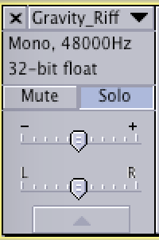

# Syncing RiffTrax to Ripped Video (Mac)

## Table of Contents

<!-- TOC -->

- [Table of Contents](#table-of-contents)
- [Requirements](#requirements)
- [Notes on installation](#notes-on-installation)
    - [`ffmpeg`](#ffmpeg)
- [Instructions](#instructions)
    - [1. rip the video to `.m4v`](#1-rip-the-video-to-m4v)
    - [2. convert container to `.mkv`](#2-convert-container-to-mkv)
    - [3. identify and extract audio track from the video](#3-identify-and-extract-audio-track-from-the-video)
    - [4. convert movie audio to `.wav` (and 5.1 sound to stereo)](#4-convert-movie-audio-to-wav-and-51-sound-to-stereo)
    - [5. create new `Audacity` project with movie audio](#5-create-new-audacity-project-with-movie-audio)
    - [6. compress movie audio](#6-compress-movie-audio)
    - [7. import RiffTrax audio to the `Audacity` project](#7-import-rifftrax-audio-to-the-audacity-project)
    - [8. trim RiffTrax intro](#8-trim-rifftrax-intro)
    - [9. initial RiffTrax sync](#9-initial-rifftrax-sync)
    - [10. silence Disembaudio](#10-silence-disembaudio)
    - [11. balance riff and movie volume](#11-balance-riff-and-movie-volume)
    - [12. auto-duck the movie](#12-auto-duck-the-movie)
    - [13. merge the audio and export to `.mp3`](#13-merge-the-audio-and-export-to-mp3)
    - [14. multiplex (mux) the movie and audio](#14-multiplex-mux-the-movie-and-audio)
    - [15. check the final output](#15-check-the-final-output)
    - [Summary](#summary)
- [Extras](#extras)
    - [NTSC to PAL audio tempo change](#ntsc-to-pal-audio-tempo-change)
    - [Correcting RiffTrax PAL speed](#correcting-rifftrax-pal-speed)

<!-- /TOC -->

## Requirements

- [`Audacity`](http://www.audacityteam.org/download/) - for audio editing
- [`ffmpeg`](https://ffmpeg.org/download.html) - for audio extraction and final construction of the video (installable with `brew`)
- [`Handbrake`](https://handbrake.fr/downloads.php) - to rip the video from the original media source (if necessary)
- [`Homebrew`](http://brew.sh/) - to install packages on the Mac
- [`mkvtoolnix`](https://mkvtoolnix.download/) - for inspection of media files (installable with `brew`)

## Notes on installation

I'll be using the movie Gravity as an example, but you should change filenames, accordingly.

As the focus of RiffTrax is really the jokes, we take some liberties with the movie audio - compressing the loud and quiet sections, and mixing down from surround/5.1 to stereo.

### `ffmpeg`

For these instructions, `ffmpeg` needs to be built with the Fraunhofer AAC codec `libfdk_aac`. Since version 2.0, `homebrew` no longer allows installation/compilation options for core packages, so this needs to be installed from a third-party tap. On the Mac, this can be done in `homebrew` using

```bash
brew tap homebrew-ffmpeg/ffmpeg
brew install homebrew-ffmpeg/ffmpeg/ffmpeg --with-fdk-aac
```

## Instructions

### 1. rip the video to `.m4v`

If you need to do this, HandBrake may be useful.

### 2. convert container to `.mkv`

```bash
ffmpeg -i Gravity.m4v -codec:v copy -codec:a copy Gravity.mkv
```

### 3. identify and extract audio track from the video

Use `mkvinfo` to identify the relevant track. You are looking for a track with Codec ID of `A_AAC`. It may have 2 tracks (stereo) or 6 (5.1). We want to identify the `track ID for mkvmerge & mkvextract` track number.

```bash
$ mkvinfo Gravity.mkv
+ EBML head
|+ EBML version: 1
|+ EBML read version: 1
|+ EBML maximum ID length: 4
|+ EBML maximum size length: 8
|+ Doc type: matroska
|+ Doc type version: 4
|+ Doc type read version: 2
[...]
| + A track
|  + Track number: 2 (track ID for mkvmerge & mkvextract: 1)
|  + Track UID: 2
|  + Lacing flag: 0
|  + Language: eng
|  + Default flag: 0
|  + Codec ID: A_AAC
|  + Track type: audio
|  + Audio track
|   + Channels: 6
|   + Sampling frequency: 48000
|   + Bit depth: 16
|  + CodecPrivate, length 2
[...]
```

Here, we have identified track 1, and can extract it to the file `audio.ac3` with `mkvextract`:

You can get straight to the track info with the following command:

```bash
mkvinfo Gravity.mkv | grep -A 6 mkvextract
```

```bash
mkvextract tracks Gravity.mkv 1:audio.ac3
```

### 4. convert movie audio to `.wav` (and 5.1 sound to stereo)

For import into the `Audacity` audio file editor, convert the movie audio to `.wav` with `ffmpeg`:

```bash
ffmpeg ‐i audio.ac3 ‐ac 2 audio.wav
```

The command above also converts the input audio to two channels (stereo).

### 5. create new `Audacity` project with movie audio

- Open `Audacity` (this will create a new project)
- Import movie audio


- Save project


### 6. compress movie audio

To even up the loud and quiet parts of the movie track, we use *compression*.

- Select the movie audio track
- Use `Effects->Compressor...` to compress the movie audio


- The image shown is a first pass at compression. Eventually I settled on a 7:1 ratio as the initial dialogue is so quiet.

### 7. import RiffTrax audio to the `Audacity` project

- Import the appropriate RiffTrax `.mp3` file. I've found that the US `.mp3`s work best for blu-ray, and the PAL `.mp3`s for DVD.


- Make sure that the RiffTrax commentary is the lower of the audio tracks - this is important for ducking, later.

- From this point on, the RiffTrax `README` file for the movie is very useful, and it's handy to have it open in a text editor window

### 8. trim RiffTrax intro

- It can be useful to `solo` the RiffTrax audio for this stage

- Locate the "and we're back" phrase in the RiffTrax audio, and place the cursor just ahead of that phrase (here, it's at 2:13.171).

- Set the `Selection Start` manually to zero and cut the section

- **optionally:** create a new track (`Tracks->Add New->Mono Track`) and paste in the audio you cut, then export the selected audio to a new file (e.g. `rifftrax_intro.wav`), if you want to preserve it. Then delete that track.

### 9. initial RiffTrax sync

- Using the RiffTrax `README` (here `Gravity_RiffTraxReadme.txt`) locate the first Disembaudio line


- Here, this is at 1:56.042 (after trimming, it tends to be slightly earlier than the movie time)


- Solo the movie audio, and identify the line in the movie - here it is at 2:05.125


- Now we can calculate an initial offset for syncing the tracks: 2:05.125 - 1:56.042 = 9.083s.
- Select the zero point at the start of the Rifftrax


- Add 9.083s of silence at the beginning of the RiffTrax audio using `Generate->Silence`


- Check manually that the audio matches. It can be useful to test the first and last couple of Disembaudio lines, to see if there's any drift during the track. To correct for noticeable drift, you can delete or insert short periods of silence at the earliest noticeable drift point, to keep the audio in sync.

### 10. silence Disembaudio

- Using the `README` file, locate and select each Disembaudio line

- Silence each selection with `Generate->Silence` while the line is selected

- Export the RiffTrax audio on its own, as a synced track


### 11. balance riff and movie volume

- Play several stretches of movie audio, and note the value in the dB meter when you do so (here, the value was around -10dB for loud sections, -12dB for quiet)

- Do the same for the RiffTrax audio (here, the value was around -2dB to -4dB)
- Now either increase the volume of the quieter track, or reduce the volume of the louder track, to even out the audio balance, by selecting the track you want to change, and using `Effect->Amplify` to add or remove gain.


- Here I chose to reduce the RiffTrax gain by 6dB, as it was generally louder than the movie, but some sections of the movie audio were already at 0dB, and I wanted to avoid clipping. Play the movie/commentary tracks together to check that the effect is satisfactory (you can always undo).

### 12. auto-duck the movie

- Use `Effects->Auto-duck...` to quieten the movie track whenever the RiffTrax commentary audio is playing. For this to work, have the movie audio positioned above the RiffTrax audio in the `Audacity` window.

- Select the movie track, then use `Effects->Auto-duck...` and set the ducking parameters


- Playback sections of the audio to check the effect is satisfactory

### 13. merge the audio and export to `.mp3`

- Select both tracks, then use `Tracks->Mix and Render`

- This will generate a single track in the project. Export the audio to an `.mp3` file


### 14. multiplex (mux) the movie and audio

Use `ffmpeg` to take the original movie video stream, and your new mixed audio, and combine them in a new `.mp4` movie

```bash
ffmpeg -i Gravity.mkv -i RiffTrax_Gravity.mp3 \
       -map 0:v:0 -map 1:a:0 \
       -c:v copy -c:a libfdk_aac \
       -metadata title="RiffTrax: Gravity" -y \
       RiffTrax_Gravity.mp4
```

The settings above do the following:

- merge the video file `Gravity.mkv` with the audio file `RiffTrax_Gravity.mp3`
- produce an output file `RiffTrax_Gravity.mp4`
- `map` the video from input stream 0 (`Gravity.mkv`) to output stream 0 (`RiffTrax_Gravity.mp4`): `-map 0:v:0`
- `map` the audio from input stream 1 (`RiffTrax_Gravity.mp3`) to output stream 0 (`RiffTrax_Gravity.mp4`): `-map 1:a:0`
- preserve the original video stream: `-c:v copy`
- convert the audio stream to AAC: `-c:a libfdk_aac`
- add a title: `-metadata title="RiffTrax: Gravity"`

### 15. check the final output

- Play the newly-muxed video in a suitable player and make sure everything's in sync
- If everything seems fine, you're done!

### Summary

```bash
ffmpeg -i <movie>.m4v -c:v copy -c:a copy <movie>.mkv
mkvinfo <movie>.mkv | grep -A 6 mkvextract
mkvextract tracks <movie>.mkv 1:audio.ac3
ffmpeg -i audio.ac3 -ac 2 audio.wav
ffmpeg -i <movie>.mkv -i audio.mp3 -map 0:v:0 -map 1:a:0 -c:v copy -c:a libfdk_aac \
  -metadata title="RiffTrax: <Movie>" -y "RiffTrax - S01E0?? - <Movie>.mp4"
```

## Extras

### NTSC to PAL audio tempo change

In some cases, there is no PAL audio available for a RiffTrax commentary (e.g. single-disc Lord of the Rings, Part One). In these cases, it is possible to use the NTSC-synced audio, and speed it up in order to match PAL framerates.

- Import the NTSC `.mp3` track
- In `Audacity`, use `Effects -> Change Tempo` and set the percentage change to `4.271` (if you want to convert PAL to NTSC, the change is `-4.096`)
- Click `OK`

### Correcting RiffTrax PAL speed

Some RiffTrax PAL audio (e.g. Return of the King) is not quite synced with PAL DVDs. These often need a small speed-up, with a tempo change of ≈`0.125` as above.
